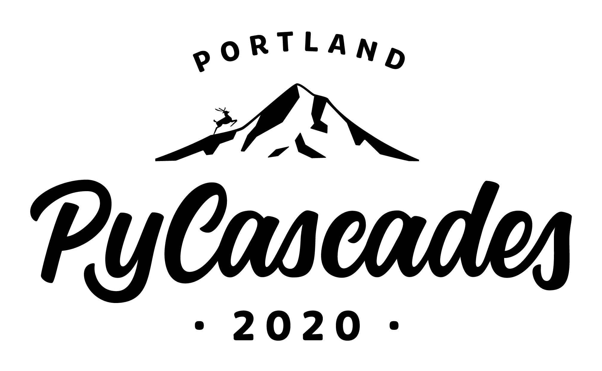

Title: Sign-up for PyCascade Sprints!
Date: 2020-02-05 08:00
Author: timothycrosley
Category: Introduction
Tags: General, Conference, SignUp, Events
slug: pycascades-sprints

Coming up VERY soon (this weekend), is my favorite yearly conference: [PyCascades](https://2020.pycascades.com/)!
It's a regional conference that takes place in the PNW, this year in Portland, covering all things Python.
If you haven't signed up yet, and live in the PNW, I encourage you to check it out!
You'll meet so many other great Pythonistas, learn about the latest technologies, and maybe even make some friends.

For the third year in a row, I'll be doing my part to help out by acting as the Sprints Lead.
Sprints occur on the Monday following the main conference.
They provide a venue for Open Source project leads/maintainers, and users to collaborate.
Many attendees have made their first-ever contribution at one of these events.
And, just as many maintainers have benefited from the growth of the contributor community.

If you are going to the conference, I also hope to see you at the Sprints!
You can sign up [here](https://ti.to/pycascades/pycascades-2020/with/dob2f4v367i).
The sprints will be the best opportunity to collaborate on projects,
ask any aching questions about one of my projects, or have fun building something new.
Additionally, if you have any desire to become a co-maintainer for any of the projects I've created,
this is the best venue for me to vet you and add you to the project.

**Project Leads / Maintainers**: If you would like to lead a project,
please submit the project [here](https://docs.google.com/forms/d/e/1FAIpQLSezL57617QWX84oosEYIHSr8yOfCCsYQli4LYDYvvbC6e1JPw/viewform).
This year I'll be given all leads a special gift packet, including a YubiKey and other goodies, to acknowledge all the hard work you take on.
Additionally, before the event, I'll send you my tips on how to best prepare for new contributors, independent of the state of your project.

You can find more information about the Sprints on [PyCascade's Website](https://2020.pycascades.com/sprints/).

Thanks, and I hope to see you there!

~Timothy
